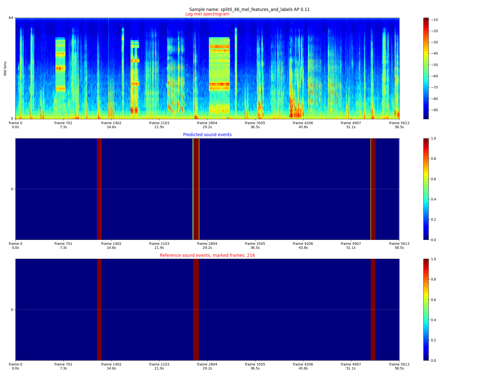

Train and evaluation of sound-event detector.

# Train a CNN detector:
Train 2d CNN on wavesound spectogram image or a 1d CNN on raw sound wave samples
- run main.py

# Train an SVM detector:
Train an SVM on Spectogram columns or frames of raw sound wave samples
- run main.py

# Requirements
- soundfile
- librosa

# Credits
- Greatly inspired by https://github.com/qiuqiangkong/dcase2019_task3

# Sound event detection example
This image is an evaluation of a detector working on the spectogram domain:
- Top: A spectogram of  60s sound file.
- Middle: Event prediction for each frame (temporal segment of sound wave). Confidence values from 0 to 1.
- Bottom: Event ground-truth for each frame. Confidence values from 0 to 1.
